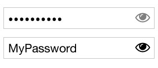

# Input Password
Baisc React.js input password with cool features.

## How to
1. Install with `npm install react-input-password`.
2. import to your "js" file.
3. See `example/basic.js` as reference.

## Features
1. Hide/Show password

## Todo
1. Password strength (Base on js regex).
2. Mobile-Like-View - Show only the last letter similar to how mobile password input behave.
3. In IE10+ input password we should disable the native browser icon since both features are the same but here we gain cross browser similar behaviour & look and feel.

## Bugs
1. When "revealActive" set to false - there is still padding at the end of the input.

## Screenshot

**Basic:**

## Dev ENV
1. Clone the project (`git clone url`).
2. Run `npm install`.
3. Run `npm start` (or better `npm run demon` in case you have `nodemon`).
4. Go to `http://localhost:3334/` - GL HF!